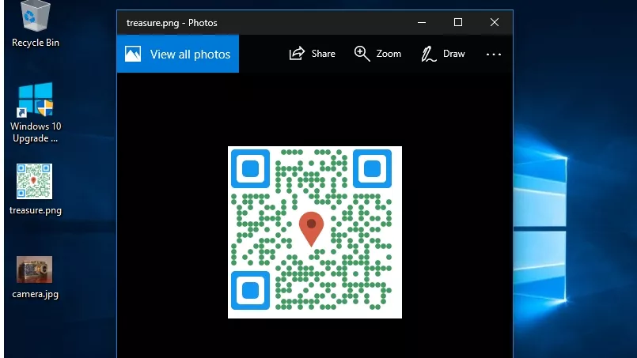
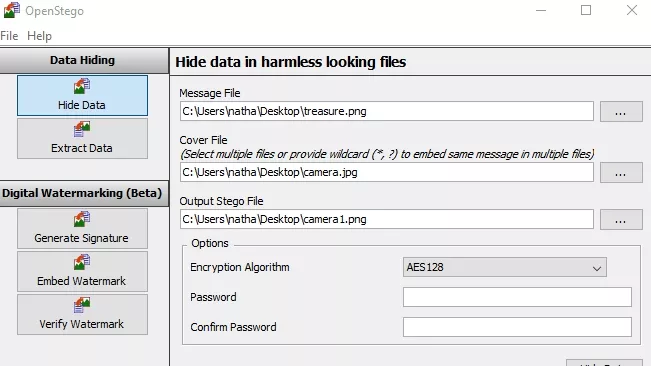

# Traffic Analysis

* Traffic Analysis HTTPS (tcp/443)
first of all we need to filter the https traffic with the query : " tcp.port eq 443" in the search bar of wireshark, and bow we get this amazing list


Let's find a https request:

 Negociation: is the first step in TCP network communication, while it's open a session between source and destination(Client/Server).
 KEX: Key Exchange or key establishment : which the sender and receiver change their public keys between them
 Encryption : the Process where the message should be unreadable for others in the same network.


---

# Steganography

> The Art of hiding Information
Before using OpenStego, we need to create the secret file we want to remain hidden. There's no restriction on the format of 'message' files – this can be a text document or another image, however it has to be smaller than the cover file it hides inside.

If our file is very large, OpenStego supports splitting it across a number of cover files. However, it's probably easier to encrypt and upload it to a website, then create a text file detailing the URL and password.

The example message file above is a QR code containing GPS coordinates of buried treasure


The cover file should be a harmless looking image, inside which the 'message' file will be stored. Give some careful thought to the image you choose. In the first instance, make sure it's bigger than the 'message' file.

In this part we gonna create an image with a message hidden in that image, for example we gonna take a nature image like this :


Once we've chosen our 'message' and 'cover' files, return to OpenStego. Click the button besides ‘Message File’ and select the file we wish to hide.


---

# Web application Security

First we have installed successfully our DVWA web application to play with it .
In the settings we changed the security level to low.
On the USERID field, we enter "1" and submit to see the comportenment of the app, it return the "ID", "First name" and "surname" of selected user as below.


Interestingly, when you check the URL, you will see there is an injectable parameter which is the ID. Currently, my URL looks like this:

```sh
http://localhost/dvwa/vulnerabilities/sqli/?id=1&Submit=Submit#

```

Let’s change the ID parameter of the URL to a number like 1,2,3,4 etc. That will also return the First_name and Surname of all users as follows:

```
ID: 2
First name: Gordon
Surname: Brown

ID: 3
First name: Hack
Surname: Me

ID: 4
First name: Pablo
Surname: Picasso
```

If we were executing this command directly on the DVWA database, the query for User ID 3 would look like this:

```
SELECT first_name, last_name FROM users WHERE user_id = '3';
```

The result in php my admin as below:


* The True scenario:


An advanced method to extract all the First_names and Surnames from the database would be to use the input: %' or '1'='1'


